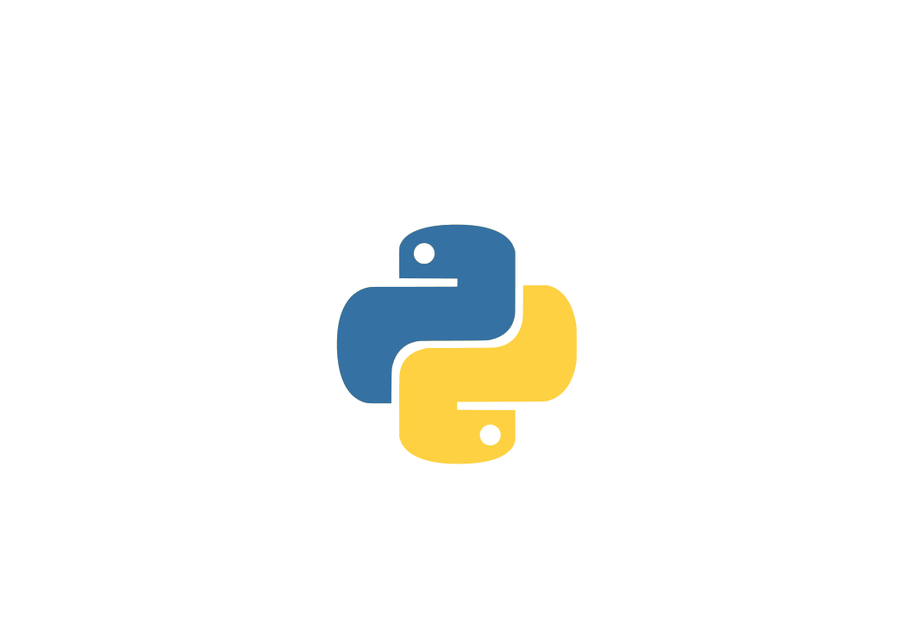
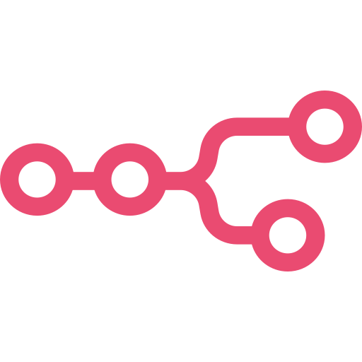
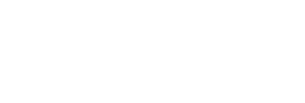

<!-- 

   -->

## Hi there 👋
# I'm Jonathan 

   

🎓 Étudiant à [École 42 Perpignan](https://42.fr)  

🛠️ En reconversion pro – Développeur -  
   Cuisinier passionné pendant près de 12 ans, ainsi que Vidéaste Autonome et Polyvalent, j'ai décidé en 2023 de quitter les fourneaux afin d'intégrer l'École 42 de Perpignan et évoluer à 100% dans le domaine de la Tech !  
    
🤖 Passionné par la robotique, l'IA, les prothèses bioniques, la pop culture et le code

## 🚀 En cours d'apprentissage
    

> J’approfondis Python et TypeScript pour des projets orientés IA et interfaces dynamiques.

---

## 💻 Compétences & Outils

### Languages

> Bonne maîtrise de C et C++ via projets 42  
> Utilisation quotidienne de Python et shell scripting

### Web / Dev Tools

> VS Code, Bash, GitHub...
> Utilisation avancée de diverses IA (Textes, Images, Vidéos, Sons).
>> [En cours]: n8n, Automatisation & Workflow, Website from scratch. 

### Autres

>🎞️ Montage vidéo pro, son, effets spéciaux  
>🎬 Connaissances solides en Réalisation vidéo (Tournage, Traitement, Montage).  
>🌐 Réseaux sociaux, Youtube...  
>🤖 Impression 3D, Bricolage électronique, Robotique.  
>🎨 Infographie - Photos, Images, Identité visuelle, Communication en ligne.  
>📊 Community Managing.  

---

## 🔧 Projets majeurs à 42

📌 `Push Swap` : algorithme de tri optimisé  
📌 `Minishell` : shell Unix personnalisé  
📌 `Webserv` : serveur HTTP 1.1 from scratch  
📌 `Cub3D` : moteur de jeu 3D en raycasting  
📌 `Transcendance` : jeu multijoueur web interactif (front + back)

---

## 🎥 Projets Perso
- 👨‍🍳 **Studio Hamster** : Auto-entrepreneur en vidéo depuis 2014 (clips, entreprises, resto)
- 🤖 **InMoov** : Projet de robot humanoïde imprimé 3D & contrôlé par IA (Python + ESP32)
- 🎬 **Chaîne YouTube** en construction !

---

## 🔗 Liens
- [LinkedIn](https://www.linkedin.com/in/...)
- [CV en ligne](https://...)
- [Portfolio](https://...)

---

> 🧠 *Toujours en quête de projets techniques humains, innovants et porteurs de sens.*  
> 👋 *Dispo pour stage dès maintenant (Robotique, IA, Dev, Tech créative).*

